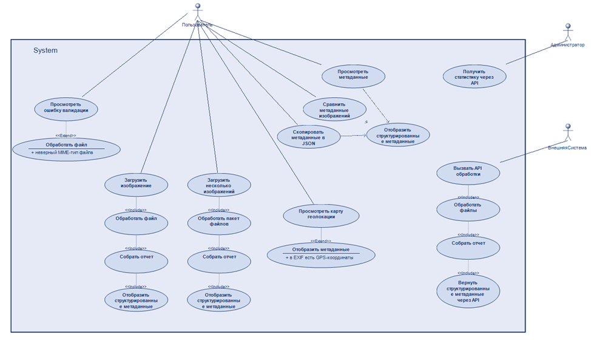
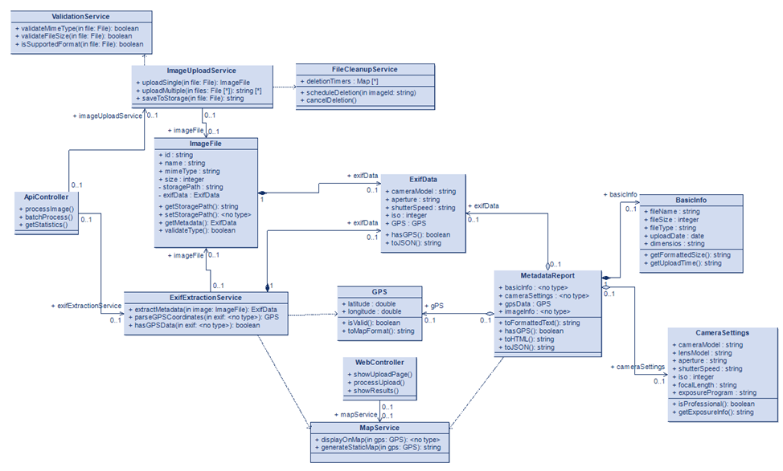

# ExifScan - Анализатор EXIF метаданных фотографий

**Веб-приложение для извлечения и анализа EXIF метаданных из цифровых фотографий**

---

## Содержание

1. [О проекте](#о-проекте)
2. [Основные возможности](#основные-возможности)
3. [Технологический стек](#технологический-стек)
4. [UML-диаграммы](#uml-диаграммы)
5. [Архитектура приложения](#архитектура-приложения)
6. [Установка и запуск](#установка-и-запуск)
7. [Использование](#использование)
8. [Структура EXIF данных](#структура-exif-данных)
9. [API документация](#api-документация)
10. [Тестирование](#тестирование)
11. [Вклад в проект](#вклад-в-проект)
12. [Лицензия](#лицензия)
13. [Контакты](#контакты)

---

## О проекте

ExifScan - это веб-приложение для анализа метаданных цифровых фотографий в формате **EXIF** (Exchangeable Image File Format). Приложение позволяет пользователям загружать изображения и получать детальную информацию о параметрах съемки, технических характеристиках файла и геолокации.

**Актуальность проекта:** В эпоху цифровой фотографии EXIF метаданные играют важную роль для фотографов, криминалистов, журналистов и обычных пользователей, позволяя анализировать условия съемки и проверять подлинность фотографий.

**Цель проекта:** Создать удобный и функциональный инструмент для извлечения и визуализации EXIF метаданных без установки дополнительного программного обеспечения.

---

## Основные возможности

### Загрузка файлов
- **Drag & Drop** интерфейс для удобной загрузки
- Поддержка файлов JPEG/JPG (основной формат с EXIF)
- Валидация размера файлов (до 10 МБ)
- Информация о процессе загрузки

### Парсинг метаданных
- Извлечение данных о камере и объективе
- Анализ настроек съемки (диафрагма, выдержка, ISO)
- Чтение временных меток (дата съемки, изменения)
- Получение GPS координат (если доступны)
- Информация о файле и изображении

### Отображение данных
- **Камера**: производитель, модель, объектив, ПО
- **Настройки**: диафрагма, выдержка, ISO, баланс белого
- **Время**: дата съемки, оцифровки, изменения
- **GPS**: координаты, высота
- **Файл**: размер, тип, разрешение, цветовое пространство

---

## Технологический стек

### Frontend
- **HTML5** - семантическая разметка
- **CSS3** - адаптивная верстка, кастомные свойства
- **JavaScript (ES6+)** - основная логика приложения
- **Модульная система ES6** - организация кода
- **ExifReader 4.15.0** - парсинг EXIF метаданных

### Архитектурные паттерны
- **MVC-подобная архитектура** - разделение ответственности
- **Классовый подход** - инкапсуляция логики
- **Observer pattern** - взаимодействие компонентов
- **Factory pattern** - создание объектов парсера

---

## UML-диаграммы

### Use Case Diagram


### Class Diagram


---

## Архитектура приложения

### Структура проекта

```tree
exifscan/
├── index.html              # Главная страница (точка входа)
├── README.md               # Документация
├── assets/                 # Статические ресурсы
│ ├── icons/                # Иконки интерфейса
│ ├── img/                  # Изображения
│ └── LOGO.svg              # Логотип проекта
├── lib/                    # Внешние библиотеки
│ └── exif-reader.min.js    # ExifReader
└── src/                    # Исходный код
   ├── app/                  # Основной скрипт приложения
   │ └── app.js              # Координатор и инициализатор всех менеджеров.
   ├── managers/             # Ядро приложения
   │ ├── uploadManager.js    # **Контроллер**: Валидация, чтение файла, инициация парсинга.
   │ ├── uiManager.js        # **View**: Управление и рендеринг DOM.
   │ ├── displayManager.js   # **Конвертер**: Преобразование данных от парсера к UI-формату.
   │ └── pageManager.js      # **View**: Управление навигацией и сменой экранов.
   ├── parsers/              # Класс для извлечения и категоризации EXIF
   │ └── ExifParser.js       # **Модель**: Бизнес-логика извлечения и структурирования данных.
   └── styles/               # Модульная структура CSS
     └── main.css
 ```

### Поток данных
1. **Загрузка файла** → UploadManager (валидация, обработка событий drag&drop)
2. **Инициация анализа** → UploadManager вызывает PageManager для показа загрузчика
3. **Парсинг EXIF** → ExifParser (извлечение сырых данных из файла)
4. **Категоризация** → ExifParser (структурирование данных по 5 категориям)
5. **Преобразование для UI** → DisplayManager (форматирование данных для отображения)
6. **Смена страниц** → PageManager (переключение на страницу результатов)
7. **Отображение данных** → UIManager (рендеринг интерфейса по категориям)
8. **Управление состоянием** → UIManager (обновление UI элементов)

---

## Установка и запуск

### Требования
- Современный браузер (Chrome 90+, Firefox 88+, Edge 90+)
- Доступ к файловой системе для загрузки файлов
- Подключение к интернету (только для первой загрузки библиотеки)

### Локальная установка и тестирование
Для полноценной работы с проектом и запуска тестов выполните следующие шаги:

```bash
# 1. Клонирование репозитория
git clone [https://github.com/ArFaris/ExifScan.git](https://github.com/ArFaris/ExifScan.git)
cd exifscan

# 2. Установка зависимостей (включая Jest и JSDOM)
npm install

# 3. Запуск тестов (см. секцию "Тестирование")
npm test

# 4. Запуск локального сервера
# Используйте любой статический сервер, например:
python -m http.server 8000
# или
npx serve .

# 5. Открыть в браузере
http://localhost:8000
```

## Быстрый запуск

Просто откройте `index.html` в браузере.

## Использование

### Шаг 1: Загрузка файла
1. **Перетащите JPEG файл** в зону загрузки
2. **Или нажмите "Выбрать файл"** для выбора вручную
3. **Поддерживаются только файлы JPEG/JPG до 10 МБ**

### Шаг 2: Анализ данных
1. **Нажмите "Получить метаданные"**
2. **Дождитесь завершения обработки** (отображается индикатор загрузки)
3. **Просмотрите результаты** по категориям

### Шаг 3: Работа с результатами
- **Камера**: информация об оборудовании (производитель, модель, объектив)
- **Настройки**: параметры съемки (диафрагма, выдержка, ISO, баланс белого)
- **Время**: временные метки (дата съемки, оцифровки, изменения)
- **GPS**: координаты (если доступны в метаданных)
- **Файл**: технические характеристики (размер, разрешение, цветовое пространство)

### Шаг 4: Сброс
**Нажмите "Сбросить файлы"** для загрузки нового изображения

## Тестирование

Проект использует фреймворк **Jest** для модульного тестирования JavaScript-кода. Это обеспечивает надежность критически важной бизнес-логики (валидация файлов, форматирование данных).

### Настройка
В файле `jest.config.js` настроено окружение **JSDOM** для корректного тестирования фронтенд-модулей, зависящих от DOM (`document` и `window`).

### Запуск тестов
Для запуска всех тестов в проекте используется команда:

```bash
npm test
```